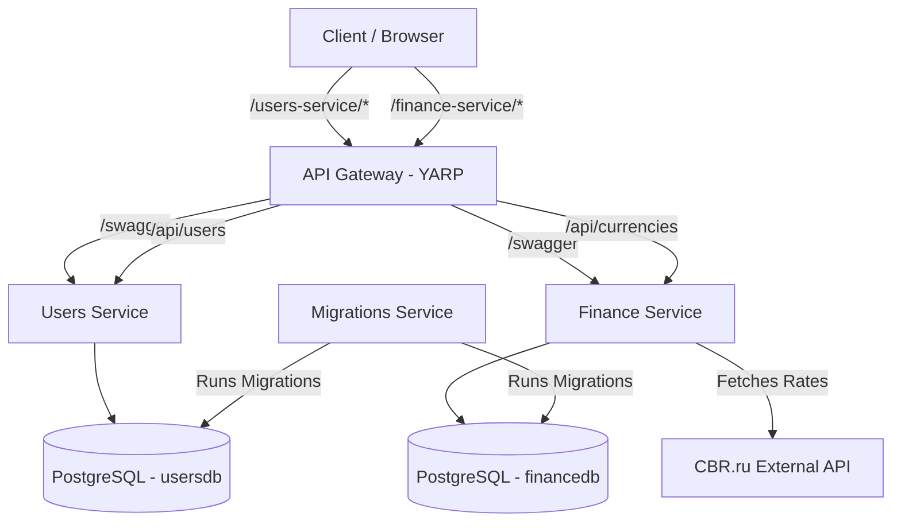

# FavoriteRates

FavoriteRates is a microservices-based application designed to manage and track favorite currency rates. It provides user authentication and real-time (scheduled) currency rate updates from external sources (CBR).

## System Architecture



## Project Structure

The project follows **Clean Architecture** principles and is divided into several microservices:

*   **`src/ApiGateway`**: Built with **YARP (Yet Another Reverse Proxy)**. Acts as the entry point for all requests, handling routing to downstream services.
*   **`src/UsersService`**: Manages user registration, login, and JWT token issuance.
*   **`src/FinanceService`**: Core business logic for currency definitions, user-favorite tracking, and rate updates. Includes a background worker for scheduled updates.
*   **`src/MigrationsService`**: A utility service that ensures all database schemas are up-to-date across all microservices on startup.
*   **`src/Shared`**: Shared libraries containing the custom Result pattern, Swagger configurations, and common utilities.
*   **`tests/`**: Unit test suites for the application and infrastructure layers of each service.

## Core Technologies

*   **Runtime**: .NET 8
*   **API**: ASP.NET Core Minimal APIs
*   **Database**: PostgreSQL with Entity Framework Core
*   **Reverse Proxy**: YARP
*   **Validation**: FluentValidation
*   **Containerization**: Docker & Docker Compose
*   **Authentication**: JWT (JSON Web Tokens)

## Getting Started

### Prerequisites

*   [.NET 8 SDK](https://dotnet.microsoft.com/download/dotnet/8.0)
*   [Docker Desktop](https://www.docker.com/products/docker-desktop) (for containerized run)
*   PostgreSQL instance (for local run)

### Running with Docker (Recommended)

The easiest way to run the entire system is using Docker Compose:

```bash
docker-compose up --build
```

Once started, you can access the service documentation via the API Gateway:
*   **Users Service Swagger**: `http://localhost:5147/users-service/swagger`
*   **Finance Service Swagger**: `http://localhost:5147/finance-service/swagger`
*   **API Gateway Port**: `5147`

### Local Development

1.  **Start PostgreSQL**: Ensure a PostgreSQL instance is running on port `5433` (or update connection strings).
2.  **Update Configuration**: Set valid connection strings in `src/FinanceService/FavoriteRates.FinanceService/appsettings.json` and `src/UsersService/FavoriteRates.UsersService/appsettings.json`.
3.  **Run Services**:
    ```bash
    # Run Users Service
    dotnet run --project src/UsersService/FavoriteRates.UsersService
    
    # Run Finance Service
    dotnet run --project src/FinanceService/FavoriteRates.FinanceService
    
    # Run Api Gateway
    dotnet run --project src/ApiGateway/FavoriteRates.ApiGateway
    ```

### Running Tests

To run all unit tests across the solution:

```bash
dotnet test
```

## API Features

*   **User Management**: Registration and Login.
*   **Favorites**: Set and manage a list of favorite currencies per user.
*   **Rates Tracking**: Scheduled background updates from CBR.ru.
*   **Security**: Protected endpoints requiring a valid JWT Bearer token.
